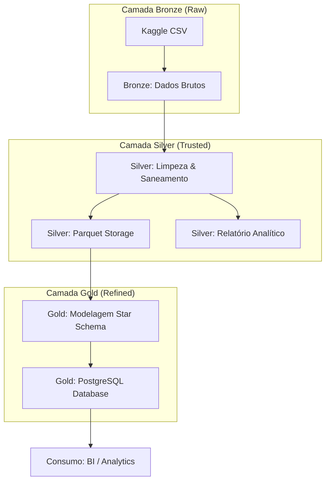
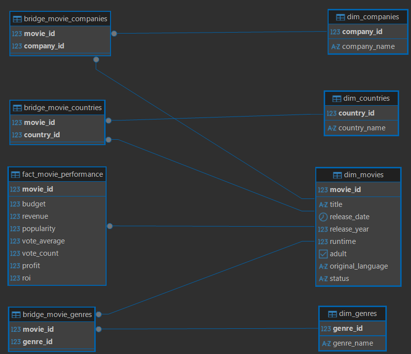
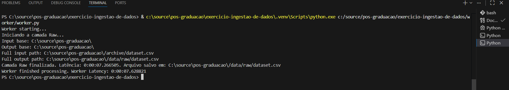
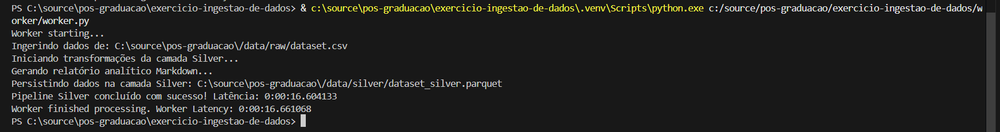
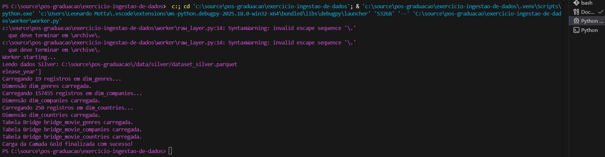

# 🎬 IMDb Data Pipeline: Medallion Architecture

Este projeto implementa um pipeline de dados robusto para o processamento de informações cinematográficas do IMDb, utilizando a arquitetura **Medallion** (Bronze, Silver e Gold). O objetivo é transformar dados brutos do Kaggle em uma estrutura analítica otimizada no PostgreSQL para suporte à tomada de decisão.

---

## 1. 🏗️ Arquitetura do Projeto

O fluxo de dados segue uma jornada de refinamento progressivo, garantindo que apenas dados de alta qualidade cheguem à camada final de consumo.

### Medallion Architecture


### Detalhes do Dataset
*   **Fonte Original**: [IMDb Data on Kaggle](https://www.kaggle.com/datasets/anandshaw2001/imdb-data/data)

---

## 2. 📂 Estrutura de Diretórios

```text
.
├── data/
│   ├── raw/                  # Dados brutos (CSV)
│   ├── silver/               # Dados processados (Parquet)
│   │   └── reports/          # Relatórios de qualidade (Markdown)
├── worker/
│   ├── gold_layer.py         # Lógica de carga na camada Gold
│   ├── silver_layer.py       # Lógica de transformação Silver
│   ├── raw_layer.py          # Lógica da camada Raw
│   ├── log_utils.py          # Classe utilitária de logs
│   ├── worker.py             # ORQUESTRADOR PRINCIPAL
│   ├── Dockerfile            # Configuração do container Worker
│   └── requirements.txt      # Dependências Python
    └── queries/
        ├── gold_queries.py   # Queries que respondem perguntas de negócio
    └── schema/
│       ├── gold_schema.py    # Start Schema
├── docker-compose.yml        # Orquestração de containers (App + DB)
├── README.md                 # Documentação do projeto
```

---

## 3. 🥇 Camada Gold: Star Schema

A camada Gold foi modelada seguindo o padrão **Star Schema** (Esquema Estrela) para otimizar consultas analíticas e facilitar a agregação de dados.

### Diagrama ER — Star Schema

> 

## 4. 🥈 Camada Silver: Qualidade & Relatórios

Durante o processamento na camada **Silver**, o pipeline executa saneamento profundo e gera um relatório de profiling automático.

### Data Quality (Problemas Resolvidos)
*   **Valores Nulos**: Remoção de registros sem `id` e imputação de `0` em colunas financeiras.
*   **Deduplicação**: Remoção de IDs duplicados e deduplicação interna de listas (ex: `"Ação, Drama, Ação"` -> `"Ação, Drama"`).
*   **Saneamento**: Limpeza de espaços em branco (`strip`) e tratamento de strings vazias ou nulas (`Unknown`).
*   **Profiling**: Geração automática de estatísticas descritivas e rankings de receita.

### Relatório Analítico
A cada execução, um relatório detalhado é gerado em:
`data/silver/reports/analytic_data_report.md`

### Relatório Analítico - Camada Silver (Filmes)
Data de Processamento: 2026-03-24 12:36:19

### 1. Caracterização de Dados (Data Profiling)
### Tipos de Dados Finais
|                      | Tipo           |
|:---------------------|:---------------|
| id                   | int64          |
| title                | str            |
| vote_average         | float64        |
| vote_count           | int64          |
| status               | str            |
| release_date         | datetime64[us] |
| revenue              | int64          |
| runtime              | int64          |
| adult                | bool           |
| budget               | int64          |
| imdb_id              | str            |
| original_language    | str            |
| original_title       | str            |
| overview             | str            |
| popularity           | float64        |
| tagline              | str            |
| genres               | str            |
| production_companies | str            |
| production_countries | str            |
| spoken_languages     | str            |
| keywords             | str            |

### Contagem de Valores Nulos
|                      |   Nulos |
|:---------------------|--------:|
| id                   |       0 |
| title                |       0 |
| vote_average         |       0 |
| vote_count           |       0 |
| status               |       0 |
| release_date         |  183292 |
| revenue              |       0 |
| runtime              |       0 |
| adult                |       0 |
| budget               |       0 |
| imdb_id              |  487461 |
| original_language    |       0 |
| original_title       |      13 |
| overview             |  215550 |
| popularity           |       0 |
| tagline              |  895146 |
| genres               |       0 |
| production_companies |       0 |
| production_countries |       0 |
| spoken_languages     |  440071 |
| keywords             |  755305 |

### 2. Insights de Negócio (Tabelas Analíticas)
### Top 10 Filmes por Receita
| title                        |    revenue | release_date        |
|:-----------------------------|-----------:|:--------------------|
| babben: the movie            | 4999999999 | NaT                 |
| TikTok Rizz Party            | 3000000000 | 2024-04-01 00:00:00 |
| Adventures in Bora Bora      | 3000000000 | 2023-08-23 00:00:00 |
| Bee Movie                    | 2930000000 | NaT                 |
| Avatar                       | 2923706026 | 2009-12-15 00:00:00 |
| Avengers: Endgame            | 2800000000 | 2019-04-24 00:00:00 |
| Avatar: The Way of Water     | 2320250281 | 2022-12-14 00:00:00 |
| Titanic                      | 2264162353 | 1997-11-18 00:00:00 |
| Star Wars: The Force Awakens | 2068223624 | 2015-12-15 00:00:00 |
| Avengers: Infinity War       | 2052415039 | 2018-04-25 00:00:00 |

### Distribuição dos 10 Idiomas mais Frequentes
| original_language   |   Contagem |
|:--------------------|-----------:|
| en                  |     565735 |
| fr                  |      62041 |
| es                  |      52864 |
| de                  |      49697 |
| ja                  |      45566 |
| zh                  |      36556 |
| pt                  |      30199 |
| it                  |      22202 |
| ru                  |      21388 |
| ko                  |      12240 |

### Resumo por Status
| status | total_filmes | receita_media |
| --- | --- | --- |
| Canceled | 262 | 0.76 |
| In Production | 10598 | 302091.65 |
| Planned | 6320 | 11.67 |
| Post Production | 8227 | 372554.12 |
| Released | 1022029 | 774030.16 |
| Rumored | 345 | 470.39 |

---
*Relatório gerado automaticamente pelo SilverLayerProcessor (Pandas 3.0.1).*


---

## 5. Logs de Execução

### Camada Raw - prints

> 

### Camada Silver🥈 - prints

> 

### Camada Gold 🥇 - prints

> 

---
## 6. 🚀 Instruções de Execução

### Banco de dados no Docker mais aplicação local
A forma mais simples de rodar o projeto completo, incluindo o banco de dados PostgreSQL.

1.  **Subir o container do banco de dados**:
    ```bash
    docker-compose up --build
    ```
    *Isso iniciará o banco de dados*

1.  **Instalar Dependências**:
    ```bash
    pip install -r worker/requirements.txt
    ```
2.  **Configurar Variáveis de Ambiente**:
    Configure o acesso ao PostgreSQL no seu terminal ou arquivo `.env`.
4. **Baixar o dataset e colocar no diretório apontado na env INPUT_DATA_PATH**

    [>> IMDb Data on Kaggle](https://www.kaggle.com/datasets/anandshaw2001/imdb-data/data)
3.  **Executar o Orquestrador**:
    ```bash
    python worker/worker.py
    ```
    *O script `worker.py` é a classe principal que coordena automaticamente as etapas Raw, Silver e Gold.*

---

